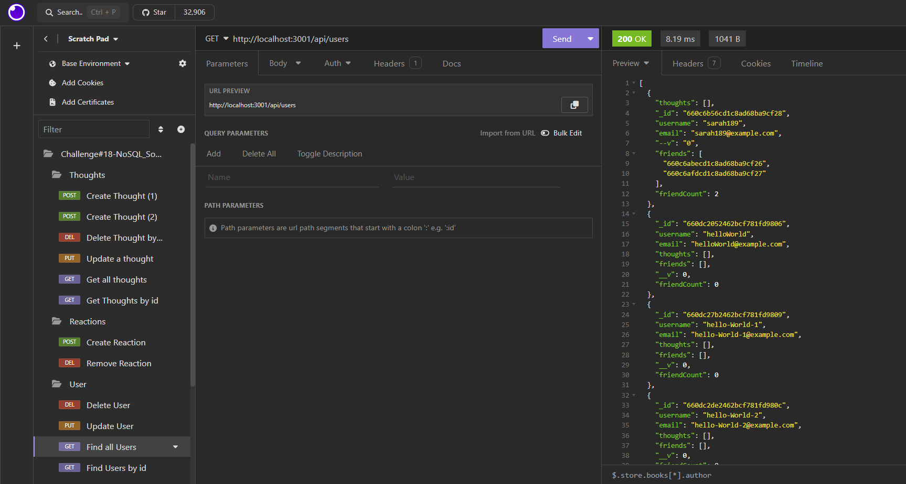

# Social-Network-API
<div align ="center">

# Social Network API


    
</div>

## Table of Contents
- [Description](#description)
- [User Story](#user-story)
- [Acceptance Criteria](#acceptance-criteria)
- [Technologies](#technologies)
- [Installation](#installation)
- [Usage](#usage)
- [Screenshot](#screenshot)
- [Contributions](#contributions)
- [Tests](#tests)
- [Links](#links)
- [Contact Information](#contact-information)
- [License](#license)

## Description
Welcome to my Social Network API! In this week's challenge, as a transitional web developer I was tasked with creating a social network API application. The Social Network API project aims to develop a robust backend system for a social networking web application. Leveraging MongoDB as the database and Express.js for routing, the API enables users to share thoughts, react to friends' posts, and manage friend lists. Meeting all acceptance criteria, including server invocation, successful CRUD operations, and proper data formatting in Insomnia, ensures the API's functionality aligns with the requirements of a scalable social media platform.

## User Story
```
AS A social media startup
I WANT an API for my social network that uses a NoSQL database
SO THAT my website can handle large amounts of unstructured data

```

## Acceptance Criteria
```
GIVEN a social network API
WHEN I enter the command to invoke the application
THEN my server is started and the Mongoose models are synced to the MongoDB database
WHEN I open API GET routes in Insomnia for users and thoughts
THEN the data for each of these routes is displayed in a formatted JSON
WHEN I test API POST, PUT, and DELETE routes in Insomnia
THEN I am able to successfully create, update, and delete users and thoughts in my database
WHEN I test API POST and DELETE routes in Insomnia
THEN I am able to successfully create and delete reactions to thoughts and add and remove friends to a user’s friend list
```

## Technologies
The technologies I used in this challenge includes:

1. Node.js
2. Express
3. MongoDB database
4. MongoDB compass
5. Mongoose package
6. Insomnia
7. Visual Studio Code(VS-code)
8. Github: Github was used to create a repository which includes all the required files, links to the projects, package.json, and the README file.
9. Gitlab: Gitlab was used to clone the project to our laptop.

## Installation
1. To install the challenge#18 , first create a new repository in your Github account, and then clone this repository to your local computer. 
```
To clone: git clone https://github.com/your-username/repository-name.git   
```           
2. Install Express [v4.19.1].

3. Install Mongoose [v7.0.2].

4. Open the cloned repository in a visual studio code.
 
5. Open integrated terminal on server.js in order to run "npm install" on the command line to install dependencies. In addition, create a gitignore file, which should includes node_modules, .env file, and .DS_Store.   

## Usage
1. Open the repository, run 'npm install' to install dependencies.

2. Open integrated terminal on server.js in order to run "npm start" to start the server and  ensure that the Mongoose models are synced to the MongoDB database. 

3. Open the Insomnia application and test the following API endpoints:

    - Testing API GET routes in Insomnia Core for users and thoughts return the data for each of these routes in a formatted JSON

    - Testing API POST, PUT, and DELETE routes in Insomnia Core are able to successfully create, update, and delete users and thoughts

    - Testing API POST and DELETE routes in Insomnia Core are able to successfully create and delete reactions to thoughts and add and remove friends to a user’s friend list.

## Screenshot




## Contributions
Contributions to the Social Network API are welcome and encouraged. Here are some ways you can contribute:

1. **Bug Reports and Feature Requests:**
  - If you encounter any issues or have suggestions for new features, please open an issue on the GitHub repository.
    
2. **Enhancements to Social Network API Application:**
  -  We welcome contributions aimed at improving this application. If you find ways to enhance the application or identify any limitations, feel free to submit a pull request.

3. **Documentation Improvements:**
  - Help improve the clarity and completeness of this documentation. If you find areas that need clarification or additional information, submit a pull request with your suggested changes.     

## Tests
Testing API routes endpoints using Insomnia

1. **Users - /api/users**

- `GET` all users
- `GET` a single user by its `_id` and populated thought and friend data
- `POST` a new user:

    ```
    // example data
    {   
        "username": "lernantino",
        "email": "lernantino@gmail.com"
    }
    ```

- `PUT` to update a user by its `_id`
- `DELETE` to remove user by its `_id`
- `DELETE` to remove user's thoughts (bonus added)
---

2. **Friends - /api/users/:userId/friends/:friendId**

- `POST` to add a new friend to a user's friend list
- `DELETE` to remove a friend from a user's friend list
---

3. **Thoughts - /api/thoughts**

- `GET` to get all `thoughts`
- `GET` to get a single thought by its `_id`
- `POST` to create a new thought (don't forget to push the created thought's _id to the associated user's thoughts array field)
```
// example data
{
  "thoughtText": "Here's a cool thought...",
  "username": "lernantino",
  "userId": "5edff358a0fcb779aa7b118b"
}
```
- `PUT` to update a thought by its `_id`
- `DELETE` to remove a thought by its `_id`
---

4. **Reactions - /api/thoughts/:thoughtId/reactions**

- `POST` to create a reaction stored in a single thought's `reactions array field`
- `DELETE` to pull and remove a reaction by the reaction's `reactionId value`

## Links
- [Video link](https://drive.google.com/file/d/1T1Mrgv7-gHu8PeqRJqG2_9u_uHc4Z6Z5/view?usp=sharing)
- [GitHub repository](https://github.com/MunibaP/Social-Network-API.git)
  
## Questions
I appreciate and encourage any questions you may have. Feel free to reach out for further information.
  
## Contact Information
- GitHub: [MunibaP](https://github.com/MunibaP)
- Email: munibapervez596@gmail.com

## License
Please refer to [MIT]() to acquire details about this license 

### Copyright © 2024 Muniba Pervez

Permission is hereby granted, free of charge, to any person obtaining a copy of this software and associated documentation files (the “Software”), to deal in the Software without restriction, including without limitation the rights to use, copy, modify, merge, publish, distribute, sublicense, and/or sell copies of the Software, and to permit persons to whom the Software is furnished to do so, subject to the following conditions:

The above copyright notice and this permission notice shall be included in all copies or substantial portions of the Software.

THE SOFTWARE IS PROVIDED “AS IS”, WITHOUT WARRANTY OF ANY KIND, EXPRESS OR IMPLIED, INCLUDING BUT NOT LIMITED TO THE WARRANTIES OF MERCHANTABILITY, FITNESS FOR A PARTICULAR PURPOSE AND NONINFRINGEMENT. IN NO EVENT SHALL THE AUTHORS OR COPYRIGHT HOLDERS BE LIABLE FOR ANY CLAIM, DAMAGES OR OTHER LIABILITY, WHETHER IN AN ACTION OF CONTRACT, TORT OR OTHERWISE, ARISING FROM, OUT OF OR IN CONNECTION WITH THE SOFTWARE OR THE USE OR OTHER DEALINGS IN THE SOFTWARE.

